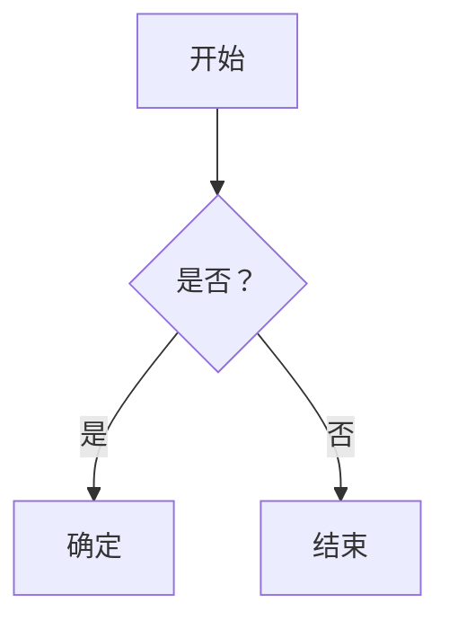

# Markdown 示例

本页面展示了 Magic Docs 中可用的各种 Markdown 功能。

## 标题

# H1 标题
## H2 标题
### H3 标题
#### H4 标题

## 文本格式化

- **粗体文本**
- *斜体文本*
- ~~删除线文本~~
- `行内代码`

## 列表

### 无序列表
- 项目 1
- 项目 2
  - 嵌套项目 1
  - 嵌套项目 2
- 项目 3

### 有序列表
1. 第一项
2. 第二项
3. 第三项

## 代码块

```javascript
const greeting = "你好，世界！";
console.log(greeting);
```

```python
def hello_world():
    print("你好，世界！")
```

## 表格

| 表头 1 | 表头 2 | 表头 3 |
|--------|--------|--------|
| 单元格 1 | 单元格 2 | 单元格 3 |
| 单元格 4 | 单元格 5 | 单元格 6 |

## 引用块

> 这是一个引用块。
> 它可以跨越多行。

## 链接和图片

### 链接
[链接到百度](https://www.baidu.com)


## 任务列表

- [x] 已完成任务
- [ ] 未完成任务

## 自定义容器

::: tip
这是一个提示容器
:::

::: warning
这是一个警告容器
:::

::: danger
这是一个危险容器
:::

## Emoji 支持

🚀 🎨 🔧 💡

## 数学公式

当 $a \ne 0$ 时，方程 $(ax^2 + bx + c = 0)$ 有两个解，它们是：

$$
x = {-b \pm \sqrt{b^2-4ac} \over 2a}
$$

## 图表



## 自定义组件

<CustomComponent>
  这是一个自定义组件
</CustomComponent> 